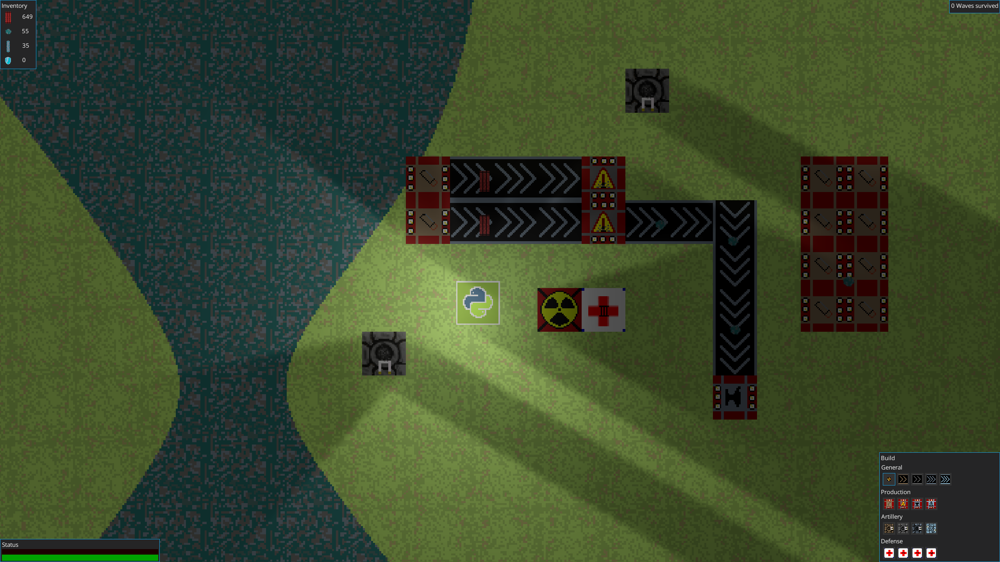
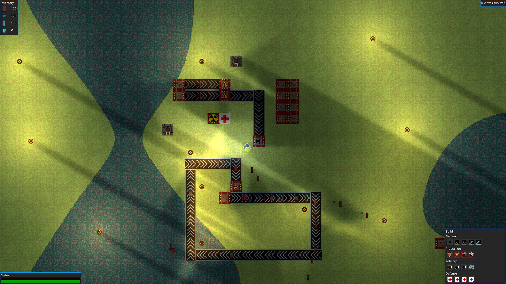

# Defactory
A simple, local LAN multiplayer tower defense game (host defends, others attack). 
Written as a school project in 2018 in Java.
It's in top-down perspective with placeable blocks like turrets, production units, and belts.

## Showcase



### Build
``` bash
# Run on desktop
./gradlew desktop:run

# Create jarfile
./gradlew desktop:dist
```
